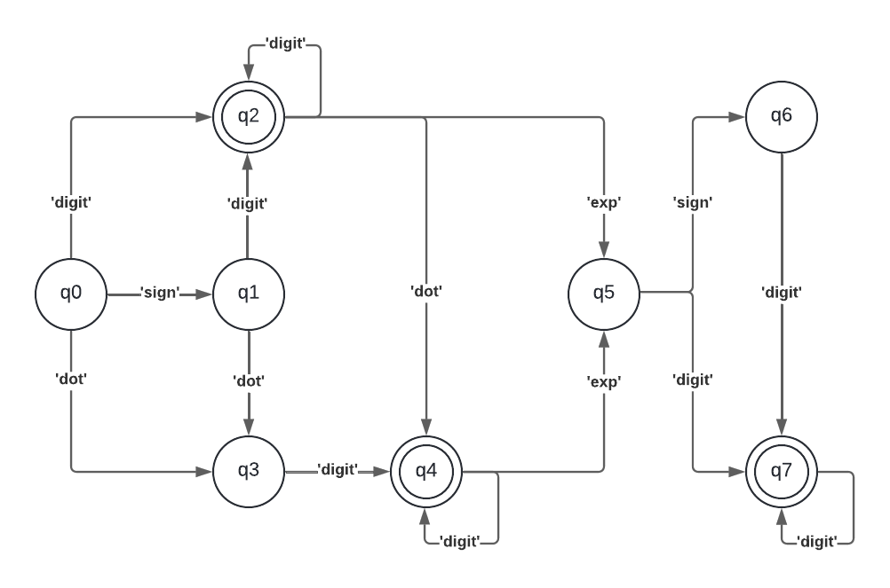

# Demonstration-of-a-Programming-Paradigm
## Description
I decide to make a demostration of the logic programming paradigm using an automaton. The main idea of this paradigm is to use a mathematical demostration to model and validate systems.

I solved the problem 65 of leetcode named "Valid Number". The problem tell us that with a given string we have to return True if that string is a valid number, otherwise we have to return False.

A valid number is defined using one of the following descriptions:
- Integer number followed by an optional exponent
- Decimal number followed by an optional exponent
- An integer number can be defined by an optional sign (+/-) followed by digits (0/9)
- A deciaml number can be defined by an optional sign (+/-) followed by one of the followings definitions
  - Digits followed by a dot '.'
  - A dot '.' followed by digits
  - Digits followed by a dot '.' followed digits
- An exponent is defined with an exponent notation (e/E) followed by an integer number

This is quite useful because if we have a program that could identify if a given string is a number we can be sure that our program can work with that numbers, for example when you want to do a lot of tests but you are not sure that all the tests you give to your program are numbers you can use this.

## Models

In the following diagram we can see how we can move all over the cases, and witch cases are valid.

These is the syntax i used inthe diagram
- digit: 0-9
- dot: .
- sign: + -
- exp: e E



## Implementation

First of all we have the creation of the DFA that is a object in python, and the definition of one of its methods. This method runs all over the given string and then moves through the states until the methon runs in the last character. This method also check if the character of the given string is in the alphabet of the DFA, otherwise the result will be False. 
```
class DFA:
    """Class to represent an automaton"""
    def __init__(self, states, alphabet, move, start, end):
        """
        Initialization of the automaton with its args.

        Args:
            states = the valid states of the automaton.
            alphabet = range of characters accepted by the automaton.
            move = a set of movements over witch the automaton could move.
            start = first posible move.
            end = a set of valid movements for the automaton.
        """
        self.states = states
        self.alphabet = alphabet
        self.move = move
        self.start = start
        self.end = end
        self.current = start

    def dfa(self, string):
        """
        Get a string that could be a valid nuumber or not.

        Returns:
            bool: True if the string is a valid number, False otherwise.
        """
        self.current = self.start
        for char in string:
            if char in self.alphabet:
                self.current = self.move[self.current][char]
            else:
                return False
        return self.current in self.end
```

After the definition of the method we define the diferets states of the DFA as an index, and the characters of the alphabet
```
states = {
    'q0', # start
    'q1', # any number
    'q2', # + -
    'q3', # e E
    'q4', # .
    'q5', # after e E
    'q6', # after .
    'q7'  # False state
}

alphabet = {
    '0', '1', '2', '3', '4', '5', '6', '7', '8', '9',
    '+', '-', 'e', 'E', '.'
}
```

Then and most importantly we define the group of movements of our DFA. This movements are defined bether in the previous diagram, but here I want to highlight that we have an aditional state 'q8', this state represents the False case. The False case is important to exist because it highlight the cases where the results are invalid, and because the program will crash if it not receive a valid move acording to a valid character of the alphabet.
```
move = {
    'q0': {  # start 
        '0': 'q2', '1': 'q2', '2': 'q2', '3': 'q2', '4': 'q2',
        '5': 'q2', '6': 'q2', '7': 'q2', '8': 'q2', '9': 'q2',
        '+': 'q1', '-': 'q1',
        'e': 'q8', 'E': 'q8',
        '.': 'q3'
    },
    'q1': {  # first sign
        '0': 'q2', '1': 'q2', '2': 'q2', '3': 'q2', '4': 'q2',
        '5': 'q2', '6': 'q2', '7': 'q2', '8': 'q2', '9': 'q2',
        '+': 'q8', '-': 'q8',
        'e': 'q8', 'E': 'q8',
        '.': 'q3'
    },
    'q2': {  # first digit
        '0': 'q2', '1': 'q2', '2': 'q2', '3': 'q2', '4': 'q2',
        '5': 'q2', '6': 'q2', '7': 'q2', '8': 'q2', '9': 'q2',
        '+': 'q8', '-': 'q8',
        'e': 'q5', 'E': 'q5',
        '.': 'q4'
    },
    'q3': {  # dot case
        '0': 'q4', '1': 'q4', '2': 'q4', '3': 'q4', '4': 'q4',
        '5': 'q4', '6': 'q4', '7': 'q4', '8': 'q4', '9': 'q4',
        '+': 'q8', '-': 'q8',
        'e': 'q8', 'E': 'q8',
        '.': 'q8'
    },
    'q4': {  # digits after dot
        '0': 'q4', '1': 'q4', '2': 'q4', '3': 'q4', '4': 'q4',
        '5': 'q4', '6': 'q4', '7': 'q4', '8': 'q4', '9': 'q4',
        '+': 'q8', '-': 'q8',
        'e': 'q5', 'E': 'q5',
        '.': 'q8'
    },
    'q5': {  # e E case
        '0': 'q7', '1': 'q7', '2': 'q7', '3': 'q7', '4': 'q7',
        '5': 'q7', '6': 'q7', '7': 'q7', '8': 'q7', '9': 'q7',
        '+': 'q6', '-': 'q6',
        'e': 'q8', 'E': 'q8',
        '.': 'q8'
    },
    'q6': {  # sign after e E
        '0': 'q7', '1': 'q7', '2': 'q7', '3': 'q7', '4': 'q7',
        '5': 'q7', '6': 'q7', '7': 'q7', '8': 'q7', '9': 'q7',
        '+': 'q8', '-': 'q8',
        'e': 'q8', 'E': 'q8',
        '.': 'q8'
    },
    'q7': {  # digits after e E
        '0': 'q7', '1': 'q7', '2': 'q7', '3': 'q7', '4': 'q7',
        '5': 'q7', '6': 'q7', '7': 'q7', '8': 'q7', '9': 'q7',
        '+': 'q8', '-': 'q8',
        'e': 'q8', 'E': 'q8',
        '.': 'q8'
    },
    'q8': {  # False case
        '0': 'q8', '1': 'q8', '2': 'q8', '3': 'q8', '4': 'q8',
        '5': 'q8', '6': 'q8', '7': 'q8', '8': 'q8', '9': 'q8',
        '+': 'q8', '-': 'q8',
        'e': 'q8', 'E': 'q8',
        '.': 'q8'
    }
}
```

Finally we have the definition of the initial state and the accepted states of the DFA
```
start = 'q0'

end = {
    'q2', # any numbre
    'q4', # final e E
    'q7' # final .
}

automaton = DFA(states, alphabet, move, start, end)
```

## Test

Example for valid numbers:
- 2
- 0089
- -0.1
- +3.14
- 4.
- -.9
- 2e10
- -90E3
- 3e+7
- +6e-1
- 53.5e93
- -123.456e789

Example for invalids numbers:
- abc
- 1a
- 1e
- e3
- 99e2.5
- --6
- -+3
- 96a54e53

The solution can also be tested submiting the code in the website of leetcode:

[LeetCode](https://leetcode.com/problems/valid-number/)

## Analysis

This problem can also be solved using a regular expresion that check if it is a valid number acording to a set of rules, for example: we can define if it will start with a dot or with a sign or any other digit, and then if it will be followd by a digit and then if it will be followed by a exponantial case, and so on.

the problem can also be solved using a grammar that in the same way as the regular expresion it will check if the string is a number acording of a set of rules but the grammar have to construct the rules from general to particular, for example: we can define a number, and this number can have a left part that can be a sign or a dot or nothing, and a right part that can be a set of digits or a set of digits followed by an exponatial, and so on.

The time complexity of my DFA is O(n), because the automaton is going to check each character in the string acording to move into the states in order to find if the string is a valid number or not
